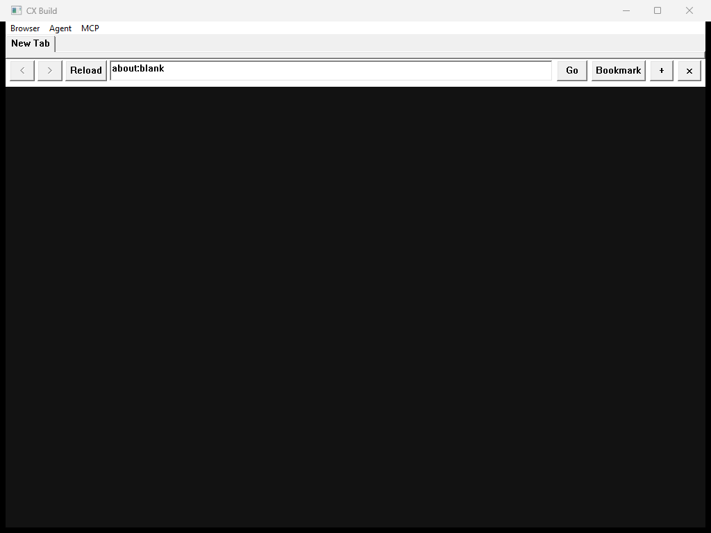
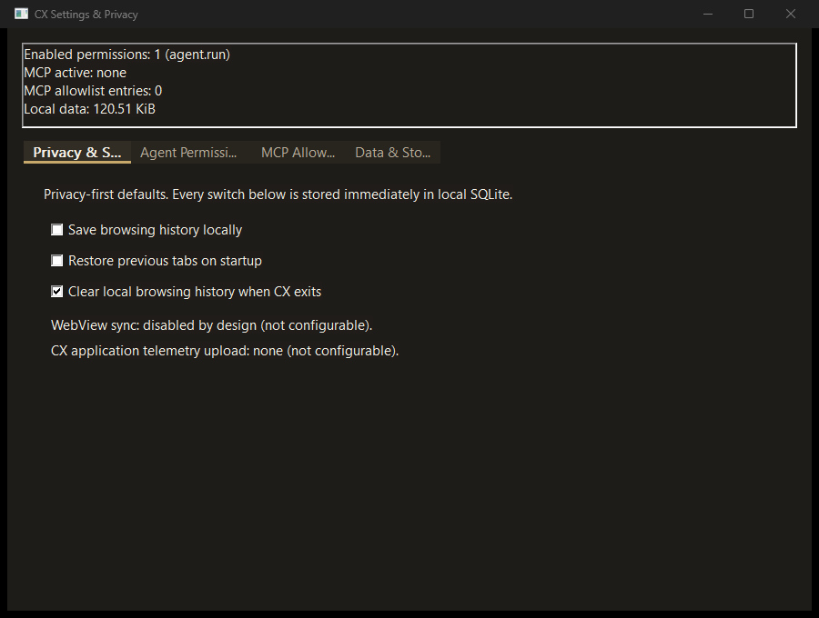

# CX Build

CX Build is a Windows, local-first browser shell written in C++20 around Microsoft WebView2. The application keeps its own settings, tabs, history, bookmarks, permissions, MCP allowlist, and logs on the local machine. Agent and MCP operations are deny-by-default and explicitly permission-gated.

## v1.0.0 release status

The default branch integrates the P01-P13 browser work plus the navigation-ID correlation fix, local-file navigation hardening, Windows-header CI repair, version-independent package verification, and the 1.0.0 packaging metadata.

Verified for the 1.0.0 release path on 2026-10-08:
- GitHub Actions run `37702770819` passed Windows Release build, CTest, direct GoogleTest, the >=80% line-coverage gate, and installer/portable package generation.
- A local Release run passed 84 GoogleTests from 20 suites.
- The local package verifier passed install/uninstall cleanup, Start Menu creation, optional PATH add/remove, zero unexpected installed files, zero CX-owned background processes after close, portable launch, and portable-local data placement.
- The generated packages are `CX-Build-Setup-1.0.0.exe` and `CX-Build-Portable-1.0.0.zip`.
- Authenticode signing is not available in the current release environment, so the observed installer status is `NotSigned`.
- Physical removable-media execution is not claimed; the successful portable verification used simulated removable-media fallback because no suitable removable drive was present.

## Important network boundary

CX itself does not contain application telemetry upload, cloud sync, or an auto-update client. User-requested browsing is network activity by definition. Microsoft WebView2 is an external runtime and may communicate with Microsoft or Windows infrastructure independently of CX. The local-core no-outbound test does not claim that the complete WebView2 process tree is network silent.

See docs/PRIVACY_POLICY.md and SECURITY.md for the exact boundary.

## Build and test

On Windows with Visual Studio C++ tools:

    cmake -S . -B build
    cmake --build build --config Release
    ctest --test-dir build -C Release --output-on-failure
    .\build\tests-bin\storage_tests.exe

Coverage:

    pwsh -NoProfile -ExecutionPolicy Bypass -File .\scripts\run_coverage.ps1 -Minimum 80

Packaging:

    pwsh -NoProfile -ExecutionPolicy Bypass -File .\installer\build_installer.ps1

Detailed instructions are in docs/BUILD.md and docs/INSTALL.md.

## Documentation

- User guide: docs/USER_GUIDE.md
- Installation and portable mode: docs/INSTALL.md
- Privacy policy: docs/PRIVACY_POLICY.md
- Architecture: docs/ARCHITECTURE.md
- UI design language: docs/UI_DESIGN.md
- Build and testing: docs/BUILD.md
- Security policy: SECURITY.md
- Contribution rules: CONTRIBUTING.md
- Current verified project state: docs/STATE.md

## Project principles

CX is local-first, permission-gated, explicit about trust boundaries, and evidence-driven. A documented test, hash, receipt, or reproducible command is preferred over a product claim that cannot be verified.

The native interface direction is Najdi utility minimalism: warm charcoal surfaces, sand/olive accents, compact density, high contrast, no gradients, no glassmorphism, and no copied browser assets. See `docs/UI_DESIGN.md`.

Offline/local ALLaM retrieval is a product direction, not a shipped repository capability at this revision.

Made with love in KSA.
